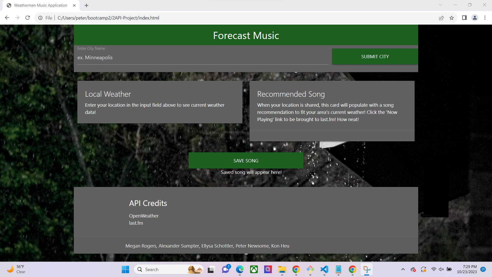

# 2API-Project

## Description

A project to utilize two APIs. This website is designed to help users find fun new songs to listen to. You first put in a city into the top search bar. The website will then find a song connected to the current weather. If you like the song you can click the save song button to save the song.

## Installation

N/A

## Usage

View our website at : https://ellysaschottler.github.io/2API-Project/

A screenshot of our site: 
## Credits

Collaborators: 
Kon Heu https://github.com/KHeu1984 
Peter Newsome https://github.com/PeterNewsome 
Megan Rogers https://github.com/megankr 
Ellysa Schottler https://github.com/ellysaschottler 
Alexander Sumpter https://github.com/xannybear 

Assets: 
OpenWeatherMap https://openweathermap.org/api 
last.fm https://www.last.fm/api 
Materialize https://materializecss.com/ 

## License
N/A
